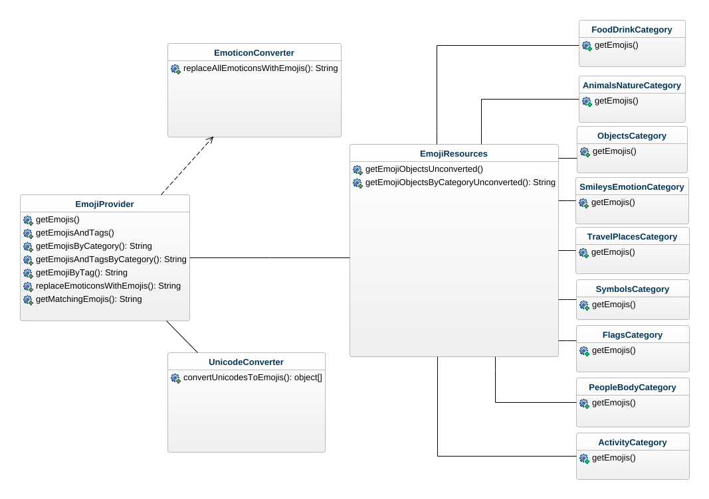

# Inlämning Laboration 1 - 1DV610

# Checklista
  - [x] Jag har skrivit all kod och reflektioner själv. Jag har inte använt mig av andras kod för att lösa uppgiften.
  - [x] Mina testresultat är skrivna utifrån utförd testning ( och inte teoretiskt: "det bör fungera" :) )
  - [x] Koden är objektorienterad
  - [x] Jag har skrivit en modul som riktar sig till programmerare

# Egenskattning och mål
  - [ ] Jag är inte klar eftersom jag vet att jag saknar något. (Då skall du inte lämna in! Lämna då istället in på restlaboration.)
  - [ ] Jag eftersträvar med denna inlämning godkänt betyg (E-D)
    - [ ] De flesta testfall fungerar
    - [ ] Koden är förberedd på Återanvändning
    - [ ] All kod samt historik finns i git 
    - [ ] Kodkvaliterskraven är ifyllda
    - [ ] Reflektion är skriven utifrån bokens kapitel 
  - [x] Jag eftersträvar med denna inlämning högre betyg (C-B) och anser mig uppfylla alla extra krav för detta. 
    - [x] Samtliga testfall är skrivna    
    - [x] Testfall är automatiserade
    - [x] Det finns en tydlig beskrivning i hur modulen skall användas (i git)
    - [x] Kodkvalitetskraven är varierade 
  - [ ] Jag eftersträvar med denna inlämning högsta betyg (A) 

Förtydligande: Examinator kommer sätta betyg oberoende på vad ni anser. 

# Återanvändning
Beskriv hur du anpassat din kod och instruktioner för att någon annan programmerare skall kunna använda din modul. Om du skrivit instruktioner för din användare, länka till dessa. Om inte, beskriv här hur någon skall göra för att använda din modul.

# Beskrivning av min kod
Nedan följer en kort beskrivning av de klasser som ingår i modulen samt ett enkelt klassdiagram som ger en översikt. Modulen består av 13 klasser.

Klassen ```EmojiProvider``` innehåller alla metoder som tillhör det publika interfacet och är själva knutpunkten för modulen. EmojiProvider har en association till UnicodeConverter och EmojiResources, och har ett beroende till UnicodeConverter.

Klassen ```UnicodeConverter``` hanterar konvertering av unicodes till emojis.

Klassen ```EmoticonConverter``` hanterar konvertering av emoticons till emojis.

Klassen ```EmojiResources``` har en association till alla klasser av emojikategorier. I EmojiResources fogas emojiobjekt samman till en enda array. Antingen alla emojiobjekt eller endast ett urval baserat på efterfrågad kategori.

Alla emojikategorier har fått en egen klass (se namn på klasserna i klassdiagrammet nedan). Varje klass har som enda uppgift att returnera en kopia av en array av emojiobjekt.



# Kravspecifikation
### Funktionella krav

| Krav | Beskrivning | Prioritet |
|------|-------------|-----------|
| 1 | Biblioteket ska kunna generera alla emojis som finns beskrivna med unicode | 1 |
| 2 | Biblioteket ska kunna generera emojis baserat på kategori | 1 |
| 3 | Biblioteket ska kunna generera emojis med motsvarande taggar | 1 |
| 4 | Biblioteket ska kunna generera emojis med motsvarande taggar baserat på kategori | 1 |
| 5 | Biblioteket ska kunna generera alla emojis vars tagg startar med givna tecken | 1 |
| 6 | Biblioteket ska kunna konvertera emoticons i text till emojis | 1 |
| 7 | Biblioteket ska kunna översätta en tagg till en emoji | 1 |
| 8 | Biblioteket ska kunna översätta taggar i text till emojis | 2 |
| 9 | Biblioteket ska kunna filtrera bort emojis som inte stöds av användarens operativsystem | 2 |

### Icke-funktionella krav

| Krav | Beskrivning | Prioritet |
|------|-------------|-----------|
| 10 | Biblioteket ska fungera i webbläsaren | 1 |
| 11 | Biblioteket ska inte ha några externa beroenden | 1 |

# Hur jag testat
Jag har testat genom manuella tester och automatisk enhetstestning. Krav som ännu inte har testfall är krav som kommer implementeras i nästa version.

## Automatiska enhetstester
Automatiska enhetstester definieras i [https://github.com/emiliaajax/emoticons/tree/main/test](https://github.com/emiliaajax/emoticons/tree/main/test) och täcker alla implementerade krav (krav 1-7). Testrapporter finns, men förutom de så har jag kört testen efter varje gång jag har gjort någon ändring av koden, till exempel när jag delat upp en metod i flera mindre, för att verifiera att jag inte har råkat göra ett misstag på vägen.

## Manuella tester
### Testmatris
| Test | UC1 | UC2 | UC3 | UC4 | UC5 | UC6 | UC7 | UC10 | UC11 |
|------|-----|-----|-----|-----|------|-----|-----|-----|-----|
| TC1.1 | 1/:white_check_mark: | 0 | 0 | 0 | 0 | 0 | 0 | 0 | 0 |
| TC2.1 | 0 | 1/:white_check_mark: | 0 | 0 | 0 | 0 | 0 | 0 | 0 |
| TC2.2 | 0 | 1/:white_check_mark: | 0 | 0 | 0 | 0 | 0 | 0 | 0 |
| TC2.3 | 0 | 1/:white_check_mark: | 0 | 0 | 0 | 0 | 0 | 0 | 0 |
| TC3.1 | 0 | 0 | 1/xx | 0 | 0 | 0 | 0 | 0 | 0 |
| TC4.1 | 0 | 0 | 0 | 1/:white_check_mark: | 0 | 0 | 0 | 0 | 0 |
| TC4.2 | 0 | 0 | 0 | 1/:white_check_mark: | 0 | 0 | 0 | 0 | 0 |
| TC4.3 | 0 | 0 | 0 | 1/:white_check_mark: | 0 | 0 | 0 | 0 | 0 |
| TC5.1 | 0 | 0 | 0 | 0 | 1/:white_check_mark: | 0 | 0 | 0 | 0 |
| TC5.2 | 0 | 0 | 0 | 0 | 1/:white_check_mark: | 0 | 0 | 0 | 0 |
| TC6.1 | 0 | 0 | 0 | 0 | 0 | 1/:white_check_mark: | 0 | 0 | 0 |
| TC6.2 | 0 | 0 | 0 | 0 | 0 | 1/:white_check_mark: | 0 | 0 | 0 |
| TC6.3 | 0 | 0 | 0 | 0 | 0 | 1/:white_check_mark: | 0 | 0 | 0 |
| TC7.1 | 0 | 0 | 0 | 0 | 0 | 0 | 1/:white_check_mark: | 0 | 0 |
| TC7.2 | 0 | 0 | 0 | 0 | 0 | 0 | 1/:white_check_mark: | 0 | 0 |
| TC10.1 | 0 | 0 | 0 | 0 | 0 | 0 | 0 | 1/:white_check_mark: | 0 |
| TC11.1 | 0 | 0 | 0 | 0 | 0 | 0 | 0 | 0 | 1/:white_check_mark: |
| COVERAGE & SUCCESS | 1/:white_check_mark: | 3/:white_check_mark:  | 1/xx  | 3/:white_check_mark: | 2/:white_check_mark: | 3/:white_check_mark: | 2/:white_check_mark: | 1/:white_check_mark: | 1/:white_check_mark: |

### Testfall
#### **TC1.1 - Lyckad generering av alla emojis**

###### **Input**

- Starta testapplikationen genom att öppna ./test-app/index.html i webbläsaren.

###### **Output**

- Alla emojis visas i den öppna emojikomponenten.

#### **TC2.1 - Lyckad generering av emojis från en tillåten kategori**

###### **Input**

- Klicka i checkboxen ”Flags”.
- Klicka på OK.
- Öppna emojikomponenten om den inte redan är öppen.
- Bläddra igenom emojikomponenten.

###### **Output**
- Endast emojis av kategorin ”Flags” visas.

#### **TC2.2 Lyckad generering av emojis från flera tillåtna kategorier**

###### **Input**

- Klicka i checkboxarna ”Flags” och ”Travel & Places”.
- Klicka på OK.
- Öppna emojikomponenten om den inte redan är öppen.
- Bläddra igenom emojikomponenten.

###### **Output**
- Endast emojis av kategorin ”Flags” och ”Travel & Places” visas.

#### **TC2.3 Misslyckad generering av emojis från en otillåten kategori**

###### **Input**

- Klicka i checkboxen ”Invalid option”.
- Klicka på OK.
- Öppna emojikomponenten om den inte redan är öppen.
- Bläddra igenom emojikomponenten.

###### **Output**
- Emojikomponenten har inte uppdaterats.
- Ett felmeddelande är utskrivet i konsolen.

#### **TC3.1 - Lyckad generering av alla emojis och taggar**

###### **Input**

- Klicka i checkboxen ”Alla”.
- Klicka på OK.
- Se på tabellen till höger.

###### **Output**

- Alla emojis och taggar visas.

#### **TC4.1 - Lyckad av generering av emojis och taggar från en tillåten kategori**

###### **Input**

- Klicka i checkboxen ”Flags”.
- Klicka på OK.
- Se på tabellen till höger.

###### **Output**

- Endast emojis och taggar av kategorin ”Flags” visas.

#### **TC4.2 Lyckad generering av emojis från flera tillåtna kategorier**

###### **Input**

- Klicka i checkboxarna ”Flags” och ”Travel & Places”.
- Klicka på OK.
- Se på tabellen till höger.

###### **Output**

- Endast emojis av kategorin ”Flags” och ”Travel & Places” visas.

#### **TC4.3 Lyckad generering av emojis och taggar från en otillåten kategori**

###### **Input**

- Klicka i checkboxen ”Invalid option”.
- Klicka på OK.
- Se på tabellen till höger.

###### **Output**

- Tabellen har inte uppdaterats.
- Ett felmeddelande är utskrivet i konsolen.

#### **TC5.1 - Lyckad generering av emojis som matchar en text**

###### **Input**

- Fyll i textfältet där det står ”Type here…” med ”sad”.
- Klicka på OK.
- Öppna emojikomponenten om den inte redan är öppen.
- Bläddra igenom emojikomponenten.

###### **Output**

- Följande emojis visas i emojikomponenten: 😓 😿 😞 😢 

#### **TC5.2 Genering av emojis som matchar text med en tom sträng**

###### **Input**

- Radera allt i textfältet.
- Klicka på OK.
- Öppna emojikomponenten.

###### **Output**

- Emojikomponenten öppnas inte på grund av att den är tom.

#### **TC6.1 Konverting av text med en emoji**

###### **Input**

- Fyll i textfältet där det står ”Write a message with emoticons here…” med ”Hej :D”.
- Klicka på symbolen för att skicka eller tryck på Enter.

###### **Output**

- ”Hej 😃” visas i rutan ovanför textfältet.

#### **TC6.2 Konvertering av text med flera emojis**

###### **Input**

- Fyll i textfältet där det står ”Write a message with emoticons here…” med ”Hej :D :) :$ Hur mår du? <3 :d :p :P :O”.
- Klicka på symbolen för att skicka eller tryck på Enter.

###### **Output**

- ”Hej 😃 😊 😳 Hur mår du? ❤️ 😃 😛 😛 😮” visas i rutan ovanför textfältet.

#### **TC6.3 Konvertering av text utan giltig emoji**

###### **Input**

- Fyll i textfältet där det står ”Write a message with emoticons here…” med ”Hej :G”.
- Klicka på symbolen för att skicka eller tryck på Enter.

###### **Output**

- ”Hej :G” visas i rutan ovanför textfältet.

#### **TC7.1 Lyckad generering av en emoji med en existerande tagg**

###### **Input**

- Fyll i textfältet där det står ”Write a tag here…” med ”piano”.
- Klicka på OK.

###### **Output**

- ”🎹” visas bredvid textfältet.

#### **TC7.2 Misslyckad generering av en emoji med en icke-existerande tagg**

###### **Input**

- Fyll i textfältet där det står ”Write a tag here…” med ”fika”.
- Klicka på OK.

###### **Output**

- Ingen emoji visas.
- Ett felmeddelande visas i konsolen.

#### **TC10.1 Lyckad bekräftelse av att biblioteket fungerar i webbläsaren**

###### **Input**

- TC1.1
- Granska att emojis visas i emojikomponenten.

###### **Output**

- Emojis visas i emojikomponenten.

#### **TC11.1 Lyckad bekräftelse av att biblioteket inte har externa beroenden**

###### **Input**

- Öppna [./package.json](https://github.com/emiliaajax/emoji-provider/blob/main/package.json)
.
- Leta efter fältet "dependencies".

###### **Output**

- Fältet "dependencies" finns inte.
- Biblioteket har inga externa beroenden.

## Testrapporter
### Testrapport 1

**Datum**: 1/10-2022<br>**Version**: 1.0.0<br>**Testmiljö**: Testerna utfördes i utvecklingsmiljö.


### Testrapport 2

**Datum**: 3/10-2022<br>**Version**: 1.0.0<br>**Testmiljö**: Testerna utfördes i utvecklingsmiljö.

| Test | UC1 | UC2 | UC3 | UC4 | UC5 | UC6 | UC7 | UC10 | UC11 |
|------|-----|-----|-----|-----|------|-----|-----|-----|-----|
| TC1.1 | 1/:white_check_mark: | 0 | 0 | 0 | 0 | 0 | 0 | 0 | 0 |
| TC2.1 | 0 | 1/:white_check_mark: | 0 | 0 | 0 | 0 | 0 | 0 | 0 |
| TC2.2 | 0 | 1/:white_check_mark: | 0 | 0 | 0 | 0 | 0 | 0 | 0 |
| TC2.3 | 0 | 1/:white_check_mark: | 0 | 0 | 0 | 0 | 0 | 0 | 0 |
| TC3.1 | 0 | 0 | 1/xx | 0 | 0 | 0 | 0 | 0 | 0 |
| TC4.1 | 0 | 0 | 0 | 1/:white_check_mark: | 0 | 0 | 0 | 0 | 0 |
| TC4.2 | 0 | 0 | 0 | 1/:white_check_mark: | 0 | 0 | 0 | 0 | 0 |
| TC4.3 | 0 | 0 | 0 | 1/:white_check_mark: | 0 | 0 | 0 | 0 | 0 |
| TC5.1 | 0 | 0 | 0 | 0 | 1/:white_check_mark: | 0 | 0 | 0 | 0 |
| TC5.2 | 0 | 0 | 0 | 0 | 1/:white_check_mark: | 0 | 0 | 0 | 0 |
| TC6.1 | 0 | 0 | 0 | 0 | 0 | 1/:white_check_mark: | 0 | 0 | 0 |
| TC6.2 | 0 | 0 | 0 | 0 | 0 | 1/:white_check_mark: | 0 | 0 | 0 |
| TC6.3 | 0 | 0 | 0 | 0 | 0 | 1/:white_check_mark: | 0 | 0 | 0 |
| TC7.1 | 0 | 0 | 0 | 0 | 0 | 0 | 1/:white_check_mark: | 0 | 0 |
| TC7.2 | 0 | 0 | 0 | 0 | 0 | 0 | 1/:white_check_mark: | 0 | 0 |
| TC10.1 | 0 | 0 | 0 | 0 | 0 | 0 | 0 | 1/:white_check_mark: | 0 |
| TC11.1 | 0 | 0 | 0 | 0 | 0 | 0 | 0 | 0 | 1/:white_check_mark: |
| COVERAGE & SUCCESS | 1/:white_check_mark: | 3/:white_check_mark:  | 1/xx  | 3/:white_check_mark: | 2/:white_check_mark: | 3/:white_check_mark: | 2/:white_check_mark: | 1/:white_check_mark: | 1/:white_check_mark: |

# Kodkvalitetskrav
### Namngivning
| Namn och förklaring  | Reflektion                                   |
| -------------------  | ---------------------------------------------|
|          **```EmojiProvider```**<br>Huvudklassen som tillhandahåller metoderna för det publika interfacet       |                      <br>**Class Names**<br>Enligt boken ska klassnamn vara substantiv eller en substantivfras (direktöversatt från *noun phrase*) och det har jag gjort här då både Emoji och Provider är substantiv.<br><br>
|      **```getEmojisAndTags()```**<br>Returnerar en array av emojiobjekt som har emoji och tag som egenskaper.           |                    <br>**Method Name**<br>Här uppfyller jag regeln med att metodnamn ska bestå av ett verb eller en fras av verb.<br><br>**Use Intention-Revealing Names & Make Meaningful Destinctions**<br>Den här metoden har bytt namn otaliga gånger och jag har aldrig blivit riktigt nöjd. Jag hade boken i bakhuvudet där det står att man ska byta namn så fort man hittar ett bättre och jag har funderat fram och tillbaka på vad jag tycker. Jag har mest alternerat mellan det slutliga metodnamnet jag valt att använda och ```getEmojiObjects```. Jag hade faktiskt bestämt mig för ```getEmojiObjects``` då objekten som returnerades även innehöll emoticons och då blev namnet ```getEmojisAndTags``` lite missvisande. Men när jag sedan skrev instruktionerna för användaren så gillade jag det inte. Det lät otydligt och jag hade frågan från boken i huvudet: *"How are the programmers in this project supposed to know which of these functions to call?"* (s.123).  Jag bestämde mig för att skriva om metoden så att den bara returnar emojis och taggar och byta tillbaka till ```getEmojisAndTags```. Nu när jag ser det i instruktionerna tycker jag att det passar mycket bättre.<br><br>                      |                          |
|       **```getMatchingEmojis(text)```**<br>Tar in en textsträng och returnerar en array med emojis som matchar den textsträngen<br>           |      <br>**Make Meaningful Distinctions**<br>Här tycker jag inte att jag lyckats speciellt väl. Jag upptäckte nu under reflektionen, när jag gick igenom koden, att jag har två metoder som heter ungefär likadant. Den första metoden är den i kolumnen till vänster och den andra är en privat metod som har namnet ```searchForMatchingEmojis(text)```. Det är svårt att avgöra vad som skiljer de här metoderna åt och jag var själv tvungen att gå igenom koden för att ta reda på skillnaden mellan dem (en skillnad som för övrigt var extremt liten, de gjorde nästan samma sak) och då är det ändå jag själv som har skrivit koden.<br><br>                                  |
|        **```replaceEmoticonsWithEmojis(text)```**<br>Tar in en text och om det finns emoticons i texten ersätter metoden alla emoticons med motsvarande emojis.         |              <br>**Use Intention-Revealing Names**<br>Här anser jag att jag lyckats med att uppfylla regeln med att namnet ska avslöja vad funktionen gör. Jag tycker att det är tydligt att när man skickar in en text som argument så kommer metoden att byta ut emoticons med emojis i texten.<br><br>**Use Searchable Names**<br>Jag tycker att metodnamnet uppfyller regeln om att vara sökbar. Metodnamnet är något längre och det kommer inte att dyka upp många resultat när man söker efter det.<br><br> **Make Meaningful Destinctions**<br>Jag såg i skrivande stund att jag faktiskt har en metod med liknande namn i en annan klass men som har "All" i namnet. Jag tycker i detta fall att det inte gör någonting då de är väldigt tätt sammankopplade (den ena är beroende av den andra) så om man skulle behöva felsöka så kommer man ändå att behöva titta i båda metoderna. De tillhör dessutom två olika klasser och kommer oavsett att behöva föregås av en klassinstans.<br><br>                         |
|         **```getEmojis()```**<br>Returnerar en array med alla emojis som finns tillgängliga i biblioteket.            |                    <br>**Avoid Disinformation**<br>Jag blir lite osäker över mitt namnval här. För boken nämner att ```get``` ska användas för accessors, mutators och predicates. Jag har använt det trots att det inte är en get-metod i den bemärkelsen. Mitt resonemang var att det returnerar någonting. Att användaren får något tillbaka och det var det jag ville berätta med namnet, men jag blir osäker på om det är bra att användas på det här sättet, eller om det räknas som vilseledande?<br><br>**Use Pronounceable Names**<br>Jag har tänkt på, under tiden jag skrivit koden, att använda vanliga namn som kan uttalas som vanligt utan att det låter konstigt eller måste bokstaveras. Jag tycker jag uppfyller det här.<br><br>                        |

### Funktioner
| Metodnamn och förklaring | Antal rader | Reflektion                              |
| -------------------  | --- | ---------------------------------------------|
|  **```getEmojisAndTags()```**<br>Returnerar en array av emojiobjekt som har emoji och tag som egenskaper.                 | 11 |             <br>**Do one thing**<br>Här tycker jag att metoden uppfyller denna regeln bra. Det enda metoden gör är att returnera en array med objekt som innehåller emojis och taggar. Den gör bara en sak. <br><br>**Function arguments**<br>Den här regeln uppfylls också bra i och med att det inte är några argument alls vilket är det bästa enligt boken. Jag förstår argumentet bakom, främst när det kommer till testning. Det är ganska tydligt att det är enklare att testa funktioner med noll argument. Jag håller dock inte med om att det är det bästa alltid. Ibland är det tydligare och känns mer logiskt, enligt mig, att skicka med ett argument till en metod istället för att exempelvis skicka med det när ett objekt instansieras.<br><br>                           |
|  **```#checkIfPresentAndReplace(emojiObject)```**<br>En privat metod som kollar om den emoticon som för nuvarande kollas upp finns i det emojiObject som skickas in som argument.                  | 10 |       <br>**One Level of Abstraction per Function & Do One Thing**<br>Den här funktionen har jag jobbat otroligt mycket med då den från början var betydligt längre med många nästlade if-satser och for-loopar. Det har varit svårt och jag har inte lyckats helt. Som man ser i funktionen så är det blandade abstraktionsnivåer (om jag har förstått abstraktionsnivåerna rätt) och den gör heller inte bara en sak som man redan kan se på val av metodnamn faktiskt. Jag har försökt komma med förändringar för att få den på samma abstraktionsnivå men jag har inte lyckats helt. Det skulle säkert gå att skriva om metoden så att den blir mer clean, men med tanke på att laborationen är tidsbegränsad så valde jag att inte fortsätta och gå vidare på annat.<br><br>**Have No Side Effects**<br>Här uppfyller metoden inte heller reglerna då den ändrar på ```this.#currentEmoji```utan att det förväntas av metoden. I och för sig, såg jag nu när jag gick och kollade tillbaka på koden, så sätts den till ett värde för första gången i den här metoden och det är ingen annan metod som behöver den oförändrad. Så nu blev jag osäker på om det faktiskt anses vara att bryta regeln eller inte? Jag gjorde nämligen på det här sättet för att kunna dela upp metoden i mindre funktioner utan att skicka med väldigt många argument.<br><br>                                   |
|  **```#getNumberOfEmoticons() {```**<br>Returnerar antal gånger en emoticon förekommer i en text.   | 3 | <br>**Small!**<br>Här är ett exempel på en metod som uppfyller båda dessa reglerna väl. Metoden är på endast tre rader.<br><br>  |
|  **```getEmojiObjectsByCategoryUnconverted (...emojiCategories)```**<br>Returnerar en array med emojiobjekt där egenskapen ```emoji``` består av en array med unicodes som motsvarar en emoji.                 | 8 |                                        <br>**Use Descriptive Names**<br>Det här metodnamnet har jag också jobbat mycket med och när jag läste kapitlet om att det inte är något dåligt att ha långa metodnamn så valde jag att gå för detta namn som jag tycker är väldigt beskrivande för vad det är man får tillbaka när man anropar den här metoden.<br><br>                       |
|  **```#getEmojiFromUnicode(unicodes)```**<br>En privat metod som konverterar arrayen med unicodes till en emoji och returnerar den emojin.                 | 7 |       <br>**One Level of Abstraction per Function**<br>Den här metoden uppfyller regeln väl och är på endast en abstraktionsnivå, nämligen låg abstraktionsnivå.<br><br>                                  |

# Laborationsreflektion
Det var väldigt intressant och lärorikt att analysera sin kod efter att ha läst boken. Det är många saker som jag har tagit med mig och kommer att tänka på när jag skriver kod i fortsättningen. **Use Intention-Revealing Names**, **Small!**, **Do One Thing**, **Function Arguments** och **One Level of Abstraction per Function** är de regler som jag upplever har gjort att min kod redan börjar bli mycket bättre. 

**Small!**<br>
Jag har ofta tänkt, som också nämndes under föreläsningen, att jag inte har velat flytta ut kod ur en funktion för att den då blir för liten. I mitt huvud har alltid lagom varit det jag har gått efter. Men det här har jag i huvudet nu när jag skriver funktioner: Gör dem små, och sedan gör dem mindre (s. 166).<br><br> 
**Function Arguments**<br>
Jag tycker också att det var intressant att reflektera över funktionsargument. Jag har aldrig tänkt på de förut. Varken om det är bra eller dåligt att ha många argument. Det enda jag har tänkt på är att jag tycker att klasser ser renare ut om man definierar argumenten som fält istället de gånger det går. Men jag förstår argumentet på att ha så få argument som möjligt, helst inga. Det är otroligt mycket lättare att testa, och vem gillar inte det?<br><br>
**One Level of Abstraction per Function**<br>
Det här är något som jag har funderat på de senaste dagarna och försökt tänka på i min kod. Jag tycker att det är svårare än det låter att försöka få en nivå av abstraktion i en funktion. Jag försökte som sagt göra det på många funktioner men det var klurigare än jag trodde. Men när jag började förstå det lite bättre tycker jag att det har varit lättare att se när det är läge att plocka ut kod till en annan funktion, exempelvis vid nästlade loopar.
<br><br>
**Do One Thing** <br>
Den här hör ju lite ihop med ovanstående men är också något jag tänker på när jag skriver metoder. Jag märker speciellt av det när jag ska namnge metoderna. De gånger jag har haft svårt att namnge för att jag inte vet hur jag ska beskriva metoden så har jag insett att den ofta gjort mer än bara en sak.
<br><br>
**Use Intention-Revealing Names**<br>
Det här är något jag har tänkt på redan sedan innan, men jag har även här fått lite mer verktyg. Jag försöker tänka att man ska kunna förstå vad en metod/variabel/klassnamn gör eller beskriver utan att behöva läsa en kommentar eller gå in i koden för att titta. Att namnet ska vara självbärande så långt det går. Jag har dock insett att det faktiskt är mycket svårare än vad jag kanske har trott att få till bra namn.
<br><br>
Överlag tycker jag att det har varit väldigt kul att se på koden på det här sättet. Jag har försökt att alltid skriva bra och ren kod men inte riktigt vetat hur jag ska tänka. Jag tycker att boken och föreläsningarna har gett mig en del ögonöppnare och verktyg för att kunna bli bättre på det.
<br><br>
Jag hade tyvärr inte så många förslag på förändringar i analysen av funktioner. Jag hade nämligen inte speciellt långa metoder eftersom jag läste boken under tiden jag jobbade med modulen, och som sagt, jag hade hela tiden det mottot i huvudet om att göra funktionera små och sedan ännu mindre. Jag hade alltså redan innan jag skrev reflektionen gjort så mycket jag har kunnat för att försöka följa de reglerna och förbättra min kod. Jag har brutit ut och pillat med metoder och jobbat mycket med att försöka få de att hamna på samma abstraktionsnivå. Jag skulle säkert kunna sitta länge och försöka göra det bätte, men som sagt, med en tidsbegränsning på laborationen måste jag också inse när det är dags att ge sig för den här gången.