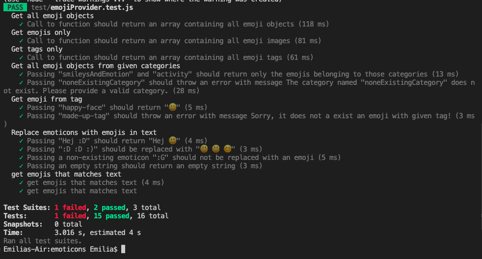

# Test report 1

**Datum**: 1/10-2022
 

**Version**: 1.0.0 

## Improvement points

The failing test is failing on error handling for invalid input for conversion of unicode to emojis for emoji objects. The error handling has has not been implemented yet and the test is there as a reminder to implement it.
