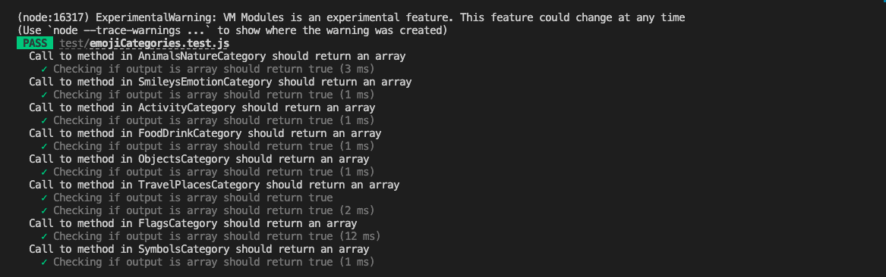
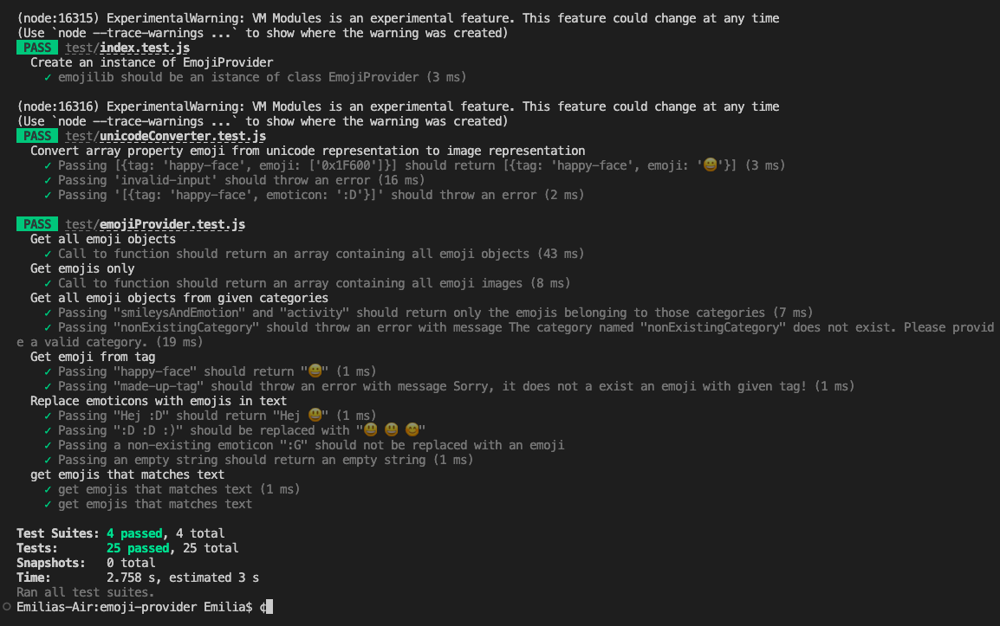

### Test report 4

**Datum**: 30/10-2022 **Version**: 1.0.0 

| Test | UC1 | UC2 | UC3 | UC4 | UC5 | UC6 | UC7 | UC10 | UC11 |
|------|-----|-----|-----|-----|------|-----|-----|-----|-----|
| TC1.1 | 1/:white_check_mark: | 0 | 0 | 0 | 0 | 0 | 0 | 0 | 0 |
| TC2.1 | 0 | 1/:white_check_mark: | 0 | 0 | 0 | 0 | 0 | 0 | 0 |
| TC2.2 | 0 | 1/:white_check_mark: | 0 | 0 | 0 | 0 | 0 | 0 | 0 |
| TC2.3 | 0 | 1/:white_check_mark: | 0 | 0 | 0 | 0 | 0 | 0 | 0 |
| TC3.1 | 0 | 0 | 1/:white_check_mark: | 0 | 0 | 0 | 0 | 0 | 0 |
| TC4.1 | 0 | 0 | 0 | 1/:white_check_mark: | 0 | 0 | 0 | 0 | 0 |
| TC4.2 | 0 | 0 | 0 | 1/:white_check_mark: | 0 | 0 | 0 | 0 | 0 |
| TC4.3 | 0 | 0 | 0 | 1/:white_check_mark: | 0 | 0 | 0 | 0 | 0 |
| TC5.1 | 0 | 0 | 0 | 0 | 1/:white_check_mark: | 0 | 0 | 0 | 0 |
| TC5.2 | 0 | 0 | 0 | 0 | 1/:white_check_mark: | 0 | 0 | 0 | 0 |
| TC6.1 | 0 | 0 | 0 | 0 | 0 | 1/:white_check_mark: | 0 | 0 | 0 |
| TC6.2 | 0 | 0 | 0 | 0 | 0 | 1/:white_check_mark: | 0 | 0 | 0 |
| TC6.3 | 0 | 0 | 0 | 0 | 0 | 1/:white_check_mark: | 0 | 0 | 0 |
| TC7.1 | 0 | 0 | 0 | 0 | 0 | 0 | 1/:white_check_mark: | 0 | 0 |
| TC7.2 | 0 | 0 | 0 | 0 | 0 | 0 | 1/:white_check_mark: | 0 | 0 |
| TC10.1 | 0 | 0 | 0 | 0 | 0 | 0 | 0 | 1/:white_check_mark: | 0 |
| TC11.1 | 0 | 0 | 0 | 0 | 0 | 0 | 0 | 0 | 1/:white_check_mark: |
| COVERAGE & SUCCESS | 1/:white_check_mark: | 3/:white_check_mark:  | 1/:white_check_mark:  | 3/:white_check_mark: | 2/:white_check_mark: | 3/:white_check_mark: | 2/:white_check_mark: | 1/:white_check_mark: | 1/:white_check_mark: |

