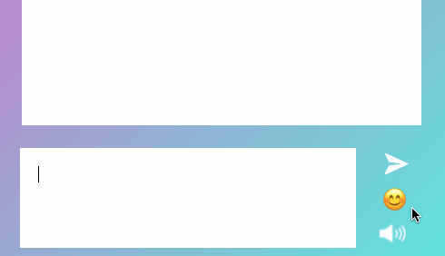

# &lt;my-emojis&gt;

A web component representing an emoji container that displays emojis when opened.

## Events

| Event Name | Fired When           |
| ---------- | -------------------- |
| `clicked` | An emoji is clicked on |
| `closed` | The emoji button container is closed |

## Example

```html
<my-emojis></my-emojis>
```


